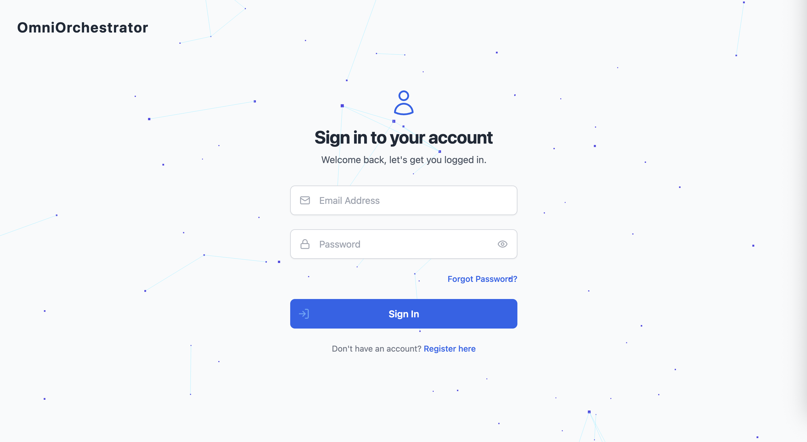
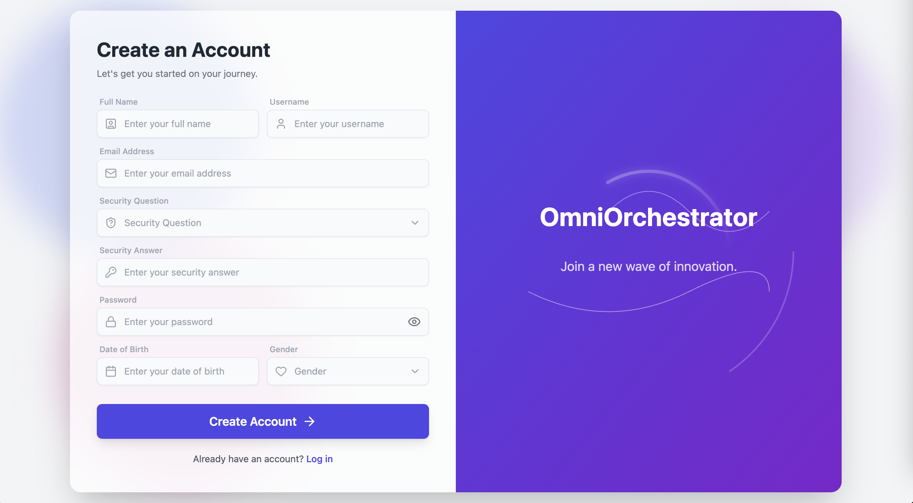
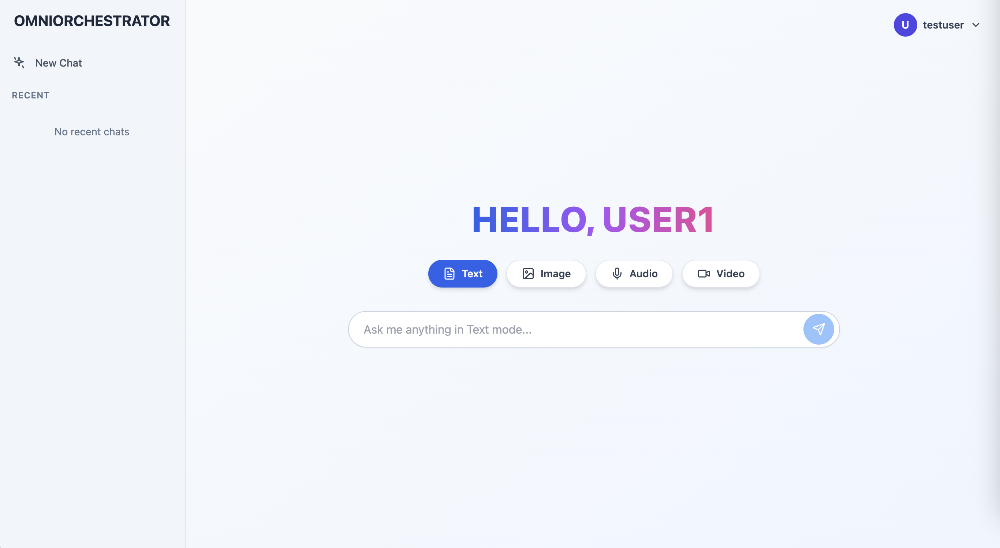
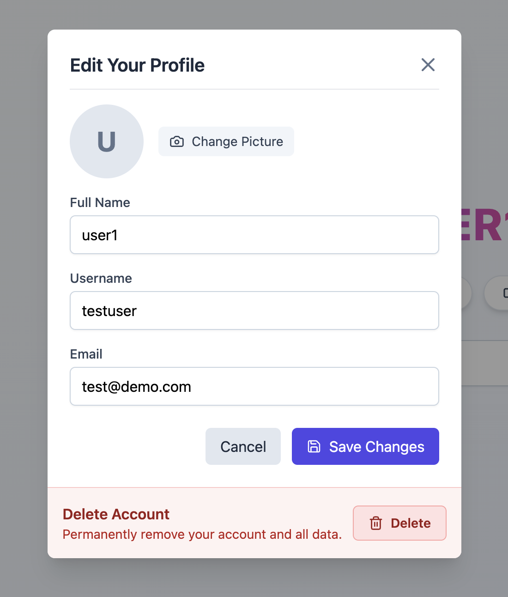
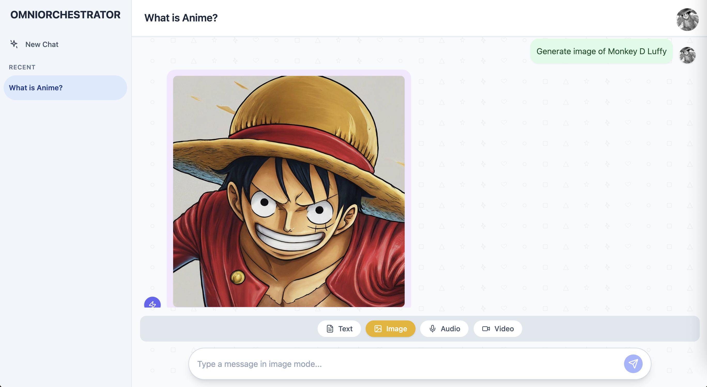
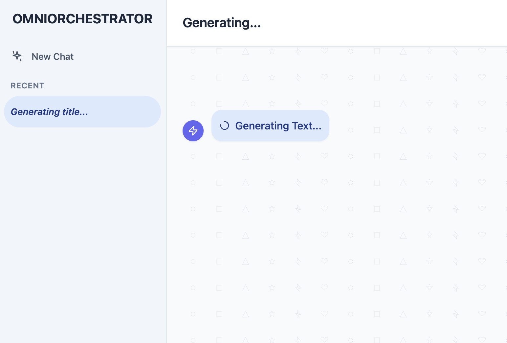
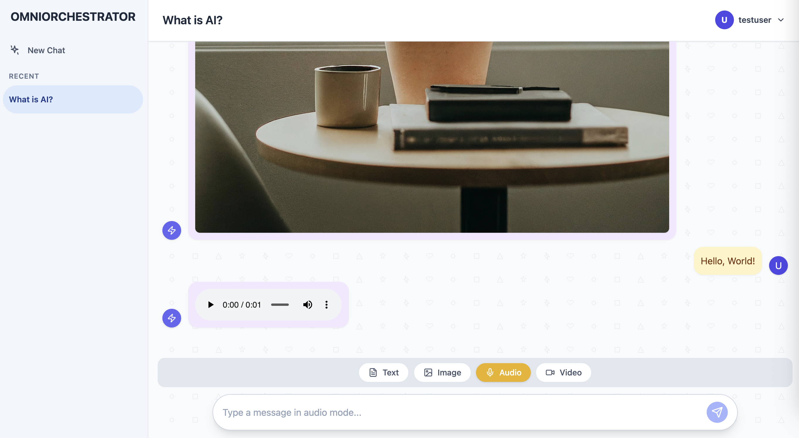
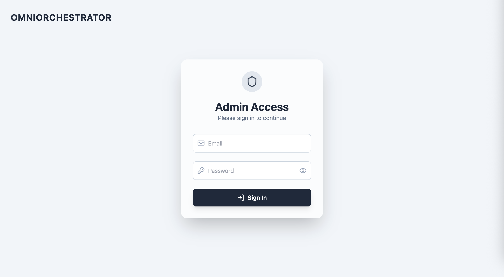
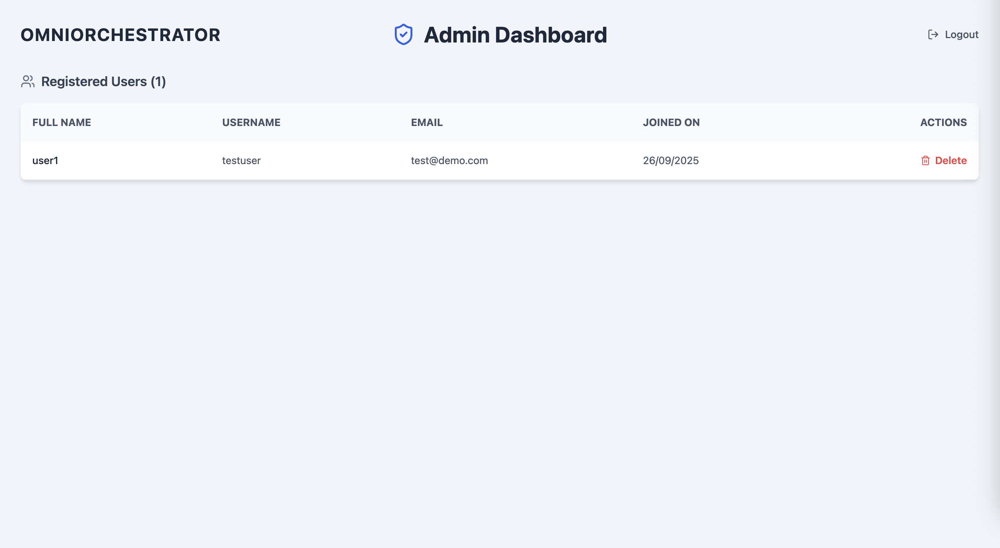

# OmniOrchestrator 🚀

### A full-stack, AI-powered chat application built with the MERN stack and Google's Generative AI.

  
  
  
  
  

A project by Sumit Singh

---

## Table of Contents

- [About The Project](#about-the-project)
- [Screenshots](#screenshots)
- [Key Features](#key-features)
- [Tech Stack](#tech-stack)
- [Getting Started](#getting-started)
- [API Endpoints](#api-endpoints)
- [License](#license)
- [Contact](#contact)

---

## About The Project

OmniOrchestrator is a modern, feature-rich MERN stack project designed to showcase a wide range of web development skills. It integrates with Google's powerful generative AI models to provide a dynamic and interactive user experience. The entire application, from the secure backend API to the polished React frontend, was built with best practices in mind, including robust security measures, efficient state management, and a professional UI/UX design.

---

## Screenshots

### User Authentication (Login & Register)

|                Login Page                 |                    Registration Page                    |
| :---------------------------------------: | :-----------------------------------------------------: |
|  |  |

### Main Chat Interface

|             User Dashboard (Welcome)              |                 User Profile Edit                  |
| :-----------------------------------------------: | :------------------------------------------------: |
|  |  |

### AI Content Generation

|                   Image Generation                    |                   Text Generation                   |                   Audio Generation                    |
| :---------------------------------------------------: | :-------------------------------------------------: | :---------------------------------------------------: |
|  |  |  |

### Admin Panel

|                 Admin Login                 |                   Admin Dashboard                   |
| :-----------------------------------------: | :-------------------------------------------------: |
|  |  |

---

## Key Features

### Full User Authentication:

- Secure user registration and login with JWT (JSON Web Tokens).
- Password hashing using `bcryptjs`.
- Secure password reset flow using a security question and answer.
- Rate limiting on login and registration to prevent brute-force attacks.

### AI-Powered Content Generation:

- **Text:** Generate text-based content using Google's Gemini models.
- **Images:** Create high-quality images from text prompts.
- **Audio:** Synthesize speech from text.
- **Video:** Placeholder for video generation.

### Rich Chat Interface:

- Real-time chat with a persistent history saved to a MongoDB database.
- Optimistic UI updates for a fast and responsive user experience.
- Support for displaying text, images, audio, and video directly in the chat.
- Options to copy text and download generated media.
- Sleek, modern UI with animations and a polished design.

### User Profile Management:

- Users can update their full name, username, and email.
- Functionality to upload, display, and remove a profile picture.
- Secure account deletion, which requires password confirmation and removes all associated user data.

### Secure Admin Panel:

- Separate, secure login for administrators.
- Admin-only dashboard to view and manage all registered users.
- Admin privileges to delete any user and their entire chat history.

---

## Tech Stack

### Backend:

- **Node.js**: JavaScript runtime environment.
- **Express.js**: Web framework for building the REST API.
- **MongoDB**: NoSQL database for storing user and chat data.
- **Mongoose**: Object Data Modeling (ODM) library for MongoDB.
- **JSON Web Token (JWT)**: For secure user authentication.
- **Google Cloud APIs**: For generative AI (Text, Image, Audio).

### Frontend:

- **React**: JavaScript library for building the user interface.
- **React Router**: For client-side routing and navigation.
- **Tailwind CSS**: For styling the application.
- **Framer Motion**: For creating smooth animations.
- **Lucide React**: For clean and consistent icons.

---

## Getting Started

To get a local copy up and running, follow these simple steps.

### Prerequisites:

- Node.js and npm installed.
- A MongoDB database (local or via Atlas).
- A Google Cloud project with the required APIs enabled and a service account.

### Backend Setup:

1. Navigate to the `server` directory: `cd server`
2. Install NPM packages: `npm install`
3. Create a `.env` file in the `server` directory and add the required variables.
4. Place your Google Cloud service account key file at `server/services/vertex-service-account.json`.
5. Run the script to create your first admin user: `node createAdmin.js`
6. Start the server: `npm start`

### Frontend Setup:

1. Navigate to the `client` directory: `cd client`
2. Install NPM packages: `npm install`
3. Start the client: `npm start`
4. The application should now be running at http://localhost:3000.

---

## API Endpoints

| Method     | Endpoint                               | Description                               | Protected | Admin |
| :--------- | :------------------------------------- | :---------------------------------------- | :-------: | :---: |
| **POST**   | `/api/auth/register`                   | Register a new user.                      |           |       |
| **POST**   | `/api/auth/login`                      | Log in a user.                            |           |       |
| **GET**    | `/api/auth/me`                         | Get the current user's profile.           |    ✅     |       |
| **PUT**    | `/api/auth/me`                         | Update the current user's profile.        |    ✅     |       |
| **DELETE** | `/api/auth/me`                         | Delete the current user's account.        |    ✅     |       |
| **POST**   | `/api/auth/get-security-question`      | Get a user's security question.           |           |       |
| **POST**   | `/api/auth/reset-password-with-answer` | Reset password using the security answer. |           |       |
| **GET**    | `/api/chats`                           | Get all chats for the current user.       |    ✅     |       |
| **POST**   | `/api/chats`                           | Create a new chat.                        |    ✅     |       |
| **GET**    | `/api/chats/:id`                       | Get a specific chat by ID.                |    ✅     |       |
| **DELETE** | `/api/chats/:id`                       | Delete a chat by ID.                      |    ✅     |       |
| **PATCH**  | `/api/chats/:id/rename`                | Rename a chat.                            |    ✅     |       |
| **POST**   | `/api/chats/:id/message`               | Add a message to an existing chat.        |    ✅     |       |
| **POST**   | `/api/admin/login`                     | Log in an admin.                          |           |       |
| **GET**    | `/api/admin/users`                     | Get a list of all users.                  |    ✅     |  ✅   |
| **DELETE** | `/api/admin/users/:id`                 | Delete a user by ID.                      |    ✅     |  ✅   |

---

## License

Distributed under the MIT License. See `LICENSE` for more information.

---

## Contact

Sumit Singh - sumitsingh.ay@gmail.com - [LinkedIn](https://www.linkedin.com/in/sumitsinghay/)

Project Link: [https://github.com/sumitsinghind/omni-orchestrator](https://github.com/sumitsinghind/omni-orchestrator)
